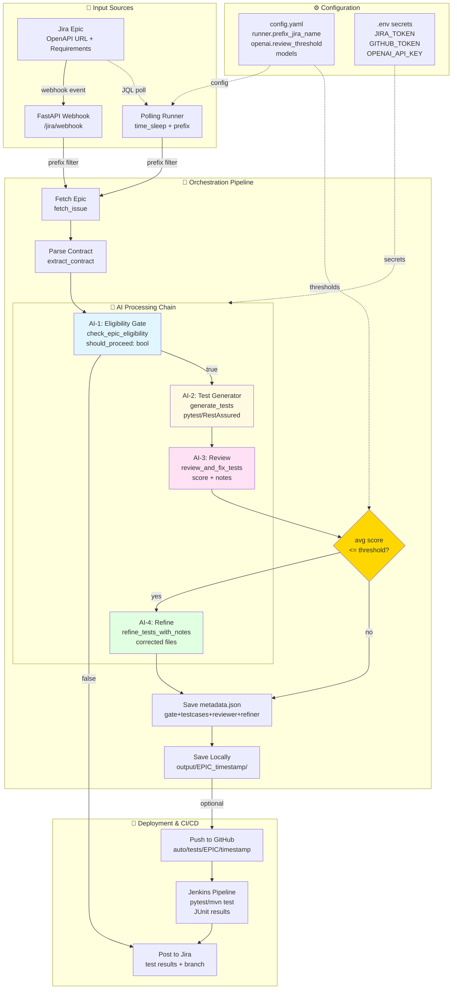

# Complete End-to-End Workflow 🔄

## 📊 Mermaid Flow Diagrams

### Complete System Flow (Jira to Jenkins)



---

## 🔄 Detailed Workflow

### Phase 1: Epic Creation & Configuration

```
Developer creates Jira Epic
       │
       ├─ Summary: "QA Validation for Orders Service API"
       │
       └─ Description:
          ├─ OpenAPI URL: http://localhost:8002/openapi.json
          ├─ Requirements
          └─ Test scenarios
```

### Phase 2: Test Generation (with eligibility gate)

```bash
# Direct single-epic run (new CLI)
python3 tests/test_orchestrator_flow.py --jira_name KAN-4 --language python --jenkins yes

# Or start the polling runner (process epics by project prefix)
python3 tests/test_orchestrator_flow.py --runner on --language python --jenkins no
```

**What Happens:**

```
Step 1: Fetch Epic from Jira
   ↓
   ├─ Connect to Jira API
   ├─ Fetch Epic details (KAN-4)
   └─ Extract summary & description
   
Step 2: Extract OpenAPI Specification
   ↓
   ├─ Parse Epic description for OpenAPI URL
   ├─ Fetch OpenAPI spec (http://localhost:8002/openapi.json)
   ├─ Parse JSON/YAML format
   └─ Extract 4 endpoints
   
Eligibility Gate (LLM)
   ↓
   ├─ Validate presence of OpenAPI URL or concrete endpoints
   ├─ Optionally verify accessibility signals
   └─ Decide: {"should_proceed": true|false, "reason": "..."}
      └─ If false → skip pipeline and post comment to Jira
   
Step 3: Generate Tests with LLM (only if should_proceed=true)
   ↓
   ├─ Build prompt with Epic + OpenAPI spec
   ├─ Call OpenAI model (configurable)
   ├─ Parse response
   └─ Generate 4-5 test files:
      ├─ tests/conftest.py (fixtures)
      ├─ tests/test_orders.py (main tests)
      ├─ tests/test_schemathesis.py (property tests)
      ├─ tests/requirements.txt (dependencies)
      └─ tests/README.md (documentation)
   
Step 4: Save Tests Locally
   ↓
   └─ output/KAN-4_20251024_124753/
      ├─ tests/
      └─ GENERATION_INFO.txt
   
Step 5: Push to GitHub
   ↓
   ├─ Create branch: auto/tests/KAN-4/20251024T071757Z
   ├─ Commit all test files
   ├─ Push to GitHub
   └─ Post comment to Jira Epic
```

### Phase 3: Jenkins Automation

```
GitHub receives push
   ↓
Webhook triggers Jenkins
   ↓
Jenkins detects new branch matching "auto/tests/*"
   ↓
   ├─ Clone repository
   ├─ Read Jenkinsfile
   └─ Start pipeline
   
Pipeline Execution:
   ↓
   ├─ Stage 1: Checkout
   │  └─ Pull code from branch
   │
   ├─ Stage 2: Detect Test Type
   │  ├─ Check for pom.xml (Java)
   │  └─ Check for tests/requirements.txt (Python)
   │
   ├─ Stage 3: Setup Environment
   │  ├─ Python: Create venv, install deps
   │  └─ Java: Verify Maven, JDK
   │
   ├─ Stage 4: Run Tests
   │  ├─ Python: pytest -v --junitxml --html
   │  └─ Java: mvn clean test
   │
   ├─ Stage 5: Publish Results
   │  ├─ Parse JUnit XML
   │  ├─ Generate HTML report
   │  └─ Archive artifacts
   │
   └─ Stage 6: Post Results
      ├─ Update Jira Epic with results
      ├─ Send notifications (email/Slack)
      └─ Mark build as SUCCESS/FAILURE
```

### Phase 4: Results & Reporting

```
Test Results Published:
   ↓
   ├─ Jenkins UI
   │  ├─ Test Results tab
   │  ├─ HTML Report
   │  └─ Console Output
   │
   ├─ Jira Epic Comment
   │  ├─ Test summary
   │  ├─ Pass/Fail counts
   │  └─ Build URL
   │
   └─ Notifications
      ├─ Email to team
      └─ Slack message
```

## 📋 Example: Python Test Generation

### Input: Jira Epic KAN-4

**Summary:** QA Validation for Orders Service API

**Description:**
```
We need comprehensive API tests for the Orders Service.

OpenAPI Specification: http://localhost:8002/openapi.json

Test Requirements:
- Test all CRUD operations for orders
- Validate error handling (400, 404, 422)
- Verify authentication requirements
- Test edge cases (invalid data, missing fields)
```

### Output: Generated Tests

```
output/KAN-4_20251024_124753/
├── tests/
│   ├── conftest.py              # 238 bytes
│   │   └── Fixtures (client, base_url, etc.)
│   │
│   ├── test_orders.py           # 3,287 bytes
│   │   ├── test_place_order_success()
│   │   ├── test_place_order_validation_error()
│   │   ├── test_list_orders_success()
│   │   ├── test_get_order_success()
│   │   ├── test_get_order_not_found()
│   │   ├── test_health_check()
│   │   └── test_service_metadata()
│   │
│   ├── test_schemathesis.py     # 266 bytes
│   │   └── Property-based tests using OpenAPI schema
│   │
│   ├── requirements.txt         # 25 bytes
│   │   └── pytest, requests, schemathesis
│   │
│   └── README.md                # 831 bytes
│       └── How to run tests
│
└── GENERATION_INFO.txt
    └── Summary & metadata
```

### GitHub Branch Created (optional)

**Branch:** `auto/tests/KAN-4/20251024T071757Z`

**Commits:**
- Add generated tests for KAN-4

**Files:**
- `tests/conftest.py`
- `tests/test_orders.py`
- `tests/test_schemathesis.py`
- `tests/requirements.txt`
- `tests/README.md`

### Jenkins Build Triggered (optional)

**Job:** API-Testing-Agent » auto/tests/KAN-4/20251024T071757Z

**Stages:**
1. ✅ Checkout (2s)
2. ✅ Detect Test Type → Python/pytest (1s)
3. ✅ Setup Python Environment (15s)
4. ✅ Run Python Tests (8s)
5. ✅ Publish Test Results (2s)
6. ✅ Generate Summary (1s)

**Results:**
- ✅ Total: 8 tests
- ✅ Passed: 7 tests
- ❌ Failed: 1 test
- Duration: 29s

### Jira Comment Posted

```
✅ Test Execution Complete

Epic: KAN-4
Framework: pytest + Schemathesis
Status: SUCCESS

Test Results:
✓ Passed: 7
✗ Failed: 1
⊘ Skipped: 0
Total: 8

Build: http://jenkins:8080/job/API-Testing-Agent/branches/auto%2Ftests%2FKAN-4%2F.../3/
Branch: auto/tests/KAN-4/20251024T071757Z
Duration: 29s
```

## 📊 Supported Test Scenarios

### Python/pytest Tests

✅ **Happy Path Tests**
- Valid request with correct data
- Successful response (200/201)
- Response contains expected fields

✅ **Validation Tests**
- Missing required fields → 422
- Invalid data types → 422
- Out of range values → 422

✅ **Error Handling Tests**
- Resource not found → 404
- Invalid ID format → 400
- Duplicate creation → 409

✅ **Authentication Tests** (if applicable)
- Missing token → 401
- Invalid token → 401
- Expired token → 401

✅ **Edge Cases**
- Empty lists
- Large payloads
- Special characters
- Concurrent requests

✅ **Schema Validation** (Schemathesis)
- All endpoints match OpenAPI spec
- Response schemas valid
- Property-based testing

### Java/RestAssured Tests

✅ **CRUD Operations**
- Create (POST)
- Read (GET)
- Update (PUT/PATCH)
- Delete (DELETE)

✅ **Request Validation**
- Headers validation
- Query parameters
- Request body validation

✅ **Response Validation**
- Status codes
- Response headers
- JSON path assertions
- Hamcrest matchers

✅ **Error Scenarios**
- HTTP errors (4xx, 5xx)
- Timeout handling
- Network errors

## 🎯 Key Features

### 1. Intelligent Test Generation
- ✅ Reads OpenAPI specs
- ✅ Understands API contracts
- ✅ Generates comprehensive tests
- ✅ Includes edge cases

### 2. Language Support
- ✅ Python (pytest + Schemathesis)
- ✅ Java (RestAssured + JUnit5)
- 🔄 More languages coming soon

### 3. Automation
- ✅ Automatic test generation
- ✅ Automatic GitHub push
- ✅ Automatic Jenkins trigger
- ✅ Automatic result posting

### 4. Integration
- ✅ Jira (Epic fetching & commenting)
- ✅ GitHub (branch & commit)
- ✅ OpenAI (test generation)
- ✅ Jenkins (CI/CD pipeline)

### 5. Flexibility
- ✅ Local-only mode (no GitHub)
- ✅ Custom test frameworks
- ✅ Configurable prompts
- ✅ Extensible architecture

## 🚀 Quick Commands (updated)

```bash
# Direct single-epic run (python)
python3 tests/test_orchestrator_flow.py --jira_name KAN-4 --language python --jenkins yes

# Direct single-epic run (java)
python3 tests/test_orchestrator_flow.py --jira_name KAN-4 --language java --jenkins yes

# Start polling runner (no GitHub push)
python3 tests/test_orchestrator_flow.py --runner on --language python --jenkins no

# Start service + runner
python3 main.py --runner on --language python --jenkins no --port 8002

# Test configuration and integrations
python3 tests/test_jira_integration.py
python3 tests/test_github_config.py
python3 setup_jenkins_integration.py
```

## 📚 Documentation

- **Quick Start**: `QUICK_START.md`
- **GitHub Setup**: `GITHUB_SETUP.md`
- **Jenkins Setup**: `JENKINS_SETUP.md`
- **Jenkins Quick Start**: `JENKINS_QUICK_START.md`
- **Full Documentation**: `README.md`
- **Architecture**: `helper.md`
- **Implementation**: `IMPLEMENTATION_SUMMARY.md`

## 🎉 Success Metrics

Your system is working when:
- ✅ Tests generate in < 30 seconds
- ✅ GitHub push successful
- ✅ Jenkins build starts automatically
- ✅ Test results appear in Jenkins
- ✅ Jira comment posted with results

---

**Congratulations! Your API Testing Agent is fully operational! 🚀**

