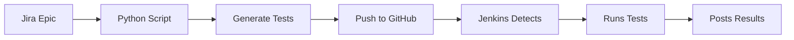

# Jenkins Quick Start Guide ⚡

Get Jenkins up and running in 10 minutes!

## 🚀 5-Minute Setup

### Step 1: Push Jenkinsfile to GitHub (1 min)

```bash
python3 setup_jenkins_integration.py
```

This will automatically push the `Jenkinsfile` to your repository.

### Step 2: Install Jenkins (Skip if already installed)

**macOS:**
```bash
brew install jenkins-lts
brew services start jenkins-lts
```

**Ubuntu/Debian:**
```bash
wget -q -O - https://pkg.jenkins.io/debian-stable/jenkins.io.key | sudo apt-key add -
sudo sh -c 'echo deb http://pkg.jenkins.io/debian-stable binary/ > /etc/apt/sources/list.d/jenkins.list'
sudo apt update
sudo apt install jenkins
sudo systemctl start jenkins
```

**Windows:**
Download from: https://www.jenkins.io/download/

**Docker (Easiest):**
```bash
docker run -p 8080:8080 -p 50000:50000 -v jenkins_home:/var/jenkins_home jenkins/jenkins:lts
```

Access Jenkins at: **http://localhost:8080**

### Step 3: Install Required Plugins (2 min)

1. Go to **Manage Jenkins** → **Manage Plugins**
2. Click **Available** tab
3. Search and install:
   - Git Plugin
   - GitHub Plugin
   - Pipeline Plugin
   - JUnit Plugin
   - HTML Publisher Plugin
4. Click **Install without restart**

### Step 3.5: Configure Maven Tool (for Java tests) (1 min)

1. Go to **Manage Jenkins** → **Global Tool Configuration**
2. Scroll to **Maven** section
3. Click **Add Maven**
4. Configure:
   - Name: `Maven-3.9.6`
   - Check ✅ **Install automatically**
   - Select version: `3.9.6` (or latest available)
5. Click **Save**

**Note:** Jenkins will automatically download Maven on the first Java build. This takes ~1 minute on first run.

### Step 4: Add GitHub Credentials (1 min)

1. Go to **Manage Jenkins** → **Manage Credentials**
2. Click **(global)** → **Add Credentials**
3. Select **Secret text**
4. Paste your GitHub Token
5. ID: `github-token`
6. Save

### Step 5: Create Pipeline Job (3 min)

1. **Dashboard** → **New Item**
2. Name: `API-Testing-Agent`
3. Select **Multibranch Pipeline**
4. Under **Branch Sources**:
   - Add source → **GitHub**
   - Credentials: `github-token`
   - Repository URL: `https://github.com/abhishek2chikun/api_testing_demo`
5. Under **Behaviors** → **Filter by name**:
   - Include: `auto/tests/*`
6. **Save**

### Step 6: Test It! (2 min)

```bash
# Generate and push Python tests
python3 test_orchestrator_flow.py KAN-4 --github

# OR generate and push Java tests
python3 test_orchestrator_flow.py KAN-4 java --github
```

Then check Jenkins Dashboard - you should see a new branch building automatically!

## 🎯 What Happens Now?



1. You run: `python3 test_orchestrator_flow.py EPIC-KEY --github`
2. Tests generated locally
3. Branch created: `auto/tests/EPIC-KEY/timestamp`
4. Jenkins automatically detects new branch
5. Jenkins runs Python or Java tests
6. Results published in Jenkins
7. (Optional) Results posted to Jira Epic

## 📊 View Test Results

After tests run:
1. Go to Jenkins Dashboard
2. Click on `API-Testing-Agent` job
3. Click on your branch (e.g., `auto/tests/KAN-4/...`)
4. Click on build number
5. See:
   - **Test Results** tab - Test summary
   - **Test Report** - HTML report with details
   - **Console Output** - Full logs

## 🔧 Optional: GitHub Webhook (Instant Triggers)

For instant build triggers (instead of polling):

1. Go to your GitHub repo → **Settings** → **Webhooks**
2. Click **Add webhook**
3. **Payload URL**: `http://your-jenkins-url:8080/github-webhook/`
4. **Content type**: `application/json`
5. **Events**: Just the push event
6. Save

**Note:** For local Jenkins, use ngrok:
```bash
ngrok http 8080
# Use the ngrok URL for webhook
```

## 🐛 Troubleshooting

### Jenkins not detecting branches?

**Solution 1:** Manual scan
- Go to job → Click **Scan Multibranch Pipeline Now**

**Solution 2:** Check branch filter
- Job → **Configure** → Verify filter: `auto/tests/*`

### Tests failing in Jenkins but passing locally?

**Solution:** Check Python/Java versions
```groovy
// Add to Jenkinsfile
stage('Debug') {
    steps {
        sh 'python3 --version'  // or 'java -version'
        sh 'pip list'            // or 'mvn -version'
    }
}
```

### "No Jenkinsfile found" error?

**Solution:** Run setup script again
```bash
python3 setup_jenkins_integration.py
```

## 📚 Advanced Features

### Add Email Notifications

Install **Email Extension Plugin**, then add to Jenkinsfile:
```groovy
post {
    always {
        emailext(
            to: 'team@example.com',
            subject: "${env.JOB_NAME} - ${currentBuild.result}",
            body: "Test results: ${env.BUILD_URL}"
        )
    }
}
```

### Add Slack Notifications

Install **Slack Notification Plugin**, then:
```groovy
post {
    success {
        slackSend(channel: '#qa', message: "Tests passed ✅")
    }
}
```

### Enable Jira Integration

1. Uncomment the `postToJira()` function in Jenkinsfile
2. Add Jira credentials to Jenkins
3. Update Jira base URL in the function

## 🎉 You're Done!

Your Jenkins pipeline is now fully automated:
- ✅ Auto-detects Python or Java tests
- ✅ Runs tests automatically on push
- ✅ Publishes results with beautiful reports
- ✅ Ready for Jira integration

**Test it now:**
```bash
python3 test_orchestrator_flow.py KAN-4 --github
```

Then watch Jenkins do its magic! 🚀

---

**Need help?** See full guide: `JENKINS_SETUP.md`

