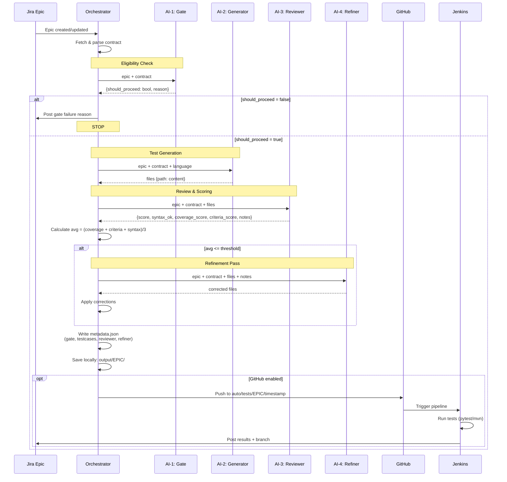
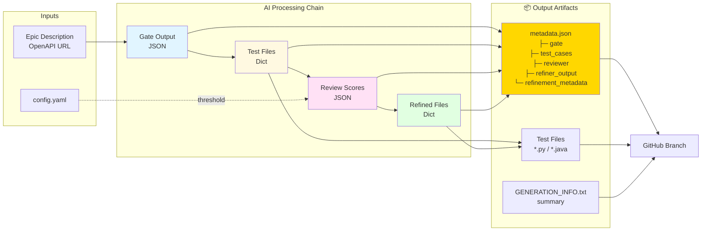

# API Testing Agent 🤖

> **Automated API test generation and execution powered by LLM**

An intelligent orchestration service that automatically:
- 📋 Reads Jira Epic specifications
- 🔍 Fetches and parses OpenAPI specifications
- 🧪 Generates comprehensive API tests using LLM (OpenAI GPT)
- 📦 Commits tests to GitHub on feature branches
- 🐳 Runs tests in isolated Docker containers
- 📊 Reports results back to Jira

---

## ✨ Key Features

- **🎯 Smart Contract Extraction**: Automatically fetches OpenAPI specs, parses endpoint definitions, or infers from descriptions
- **🤖 LLM-Powered Generation**: Uses GPT-4 to generate comprehensive pytest tests with full coverage
- **🔄 Full Automation**: Webhook → Fetch → Generate → Commit → Test → Report
- **🌐 Multiple Input Formats**: Supports OpenAPI URLs, manual endpoints, or plain descriptions
- **📐 ADF Support**: Handles Jira API v3's Atlassian Document Format
- **🐳 Isolated Execution**: Runs tests in Docker containers for safety
- **✅ Comprehensive Testing**: Includes happy path, validation, 404s, auth, and edge cases

---

## 🏗️ Architecture

```
┌─────────────┐
│ Jira Epic   │  ← Contains OpenAPI URL or endpoint definitions
└──────┬──────┘
       │ Webhook
       ▼
┌─────────────────────┐             ┌──────────────────────────┐
│  FastAPI Webhook    │             │  Polling Runner          │
│  (core/webhooks.py) │             │  (core/epic_runner.py)   │
└──────────┬──────────┘             └──────────┬───────────────┘
           │                                     │
           └───────────────┬─────────────────────┘
                           ▼
┌──────────────────────────────────────────────────────────┐
│              ORCHESTRATION PIPELINE                       │
│              (core/orchestrator.py)                       │
├──────────────────────────────────────────────────────────┤
│  1. Fetch Epic from Jira                                 │
│     └─> integrations/jira/client.py                      │
│                                                           │
│  2. Extract & Fetch API Contract                         │
│     └─> integrations/jira/contract_parser.py             │
│         ├─> Extract OpenAPI URL from description         │
│         ├─> Fetch & parse OpenAPI spec (JSON/YAML)       │
│         └─> Extract manual endpoints or use description  │
│                                                           │
│  3. Eligibility Gate (LLM)                               │
│     └─> services/test_generator/gating.py                │
│         ├─> Output: {"should_proceed": bool, "reason": ""}│
│         └─> If false → skip and post comment             │
│                                                           │
│  4. Generate Tests with LLM                              │
│     └─> services/test_generator/generator.py             │
│         ├─> Format Epic + OpenAPI spec into prompt       │
│         ├─> Call OpenAI (configurable model)             │
│         └─> Parse generated test files                   │
│                                                           │
│  5. Review & Refine (LLM)                                │
│     └─> services/test_generator/reviewer.py              │
│         ├─> Score: syntax, coverage, criteria            │
│         ├─> Notes: detailed findings                     │
│         └─> If below threshold → refine with notes       │
│     └─> services/test_generator/refiner.py               │
│                                                           │
│  6. Commit to GitHub                                     │
│     └─> integrations/github/client.py                    │
│         └─> Create branch: auto/tests/{epic}/{timestamp} │
│                                                           │
│  7. Run Tests in Docker                                  │
│     └─> services/test_runner/runner.py                   │
│         ├─> Clone branch to temp directory               │
│         ├─> Run pytest in python:3.11 container          │
│         └─> Parse JUnit XML results                      │
│                                                           │
│  8. Post Results to Jira                                 │
│     └─> integrations/jira/client.py                      │
│         └─> Add comment with test results                │
└──────────────────────────────────────────────────────────┘
```

---

## 🔄 Detailed AI Processing Flow



## 📦 Data Flow & Artifacts



---

## 📁 Project Structure

```
api_testing_agent/
├── core/                           # Core orchestration & webhook handling
│   ├── __init__.py
│   ├── webhooks.py                # FastAPI app with webhook endpoints
│   └── orchestrator.py            # Main pipeline coordination logic
│
├── integrations/                   # External service integrations
│   ├── jira/                      # Jira API client & parsing
│   │   ├── __init__.py
│   │   ├── client.py              # Fetch issues, post comments
│   │   └── contract_parser.py    # Extract & fetch OpenAPI specs
│   └── github/                    # GitHub API client
│       ├── __init__.py
│       └── client.py              # Create branches, commit files
│
├── services/                       # Business logic services
│   ├── test_generator/            # LLM-based test generation
│   │   ├── __init__.py
│   │   ├── generator.py           # Test generation orchestration
│   │   └── prompts.py             # LLM prompt templates
│   └── test_runner/               # Test execution
│       ├── __init__.py
│       └── runner.py              # Docker-based test runner
│
├── tests/                          # Test suite
│   ├── __init__.py
│   ├── test_jira_integration.py   # Comprehensive integration tests
│   ├── test_jira_manual.py        # Manual test script (no pytest)
│   ├── README.md                  # Testing documentation
│   └── sample_pytest.py           # Example generated tests
│
├── config/                         # Configuration
├── examples/                       # Example templates
├── README.md                       # This file
├── helper.md                       # Detailed documentation
├── IMPLEMENTATION_SUMMARY.md      # Technical implementation details
├── notes.md                        # Architecture notes
├── requirements.txt               # Python dependencies
├── env.example                    # Environment variables template
├── pyproject.toml                 # Project metadata
├── main.py                        # Main entry point
└── docker-runner.sh               # Helper script for local testing
```

---

## 🚀 Quick Start

### 1. Prerequisites

- Python 3.9+
- Docker (for running tests)
- Jira account with API access
- GitHub account with repository access
- OpenAI API key

### 2. Installation

```bash
# Clone the repository
git clone <your-repo-url>
cd api_testing_agent

# Create virtual environment
python -m venv venv
source venv/bin/activate  # On Windows: venv\Scripts\activate

# Install dependencies
pip install -r requirements.txt
```

### 3. Configuration

Create a `.env` file in the project root:

```bash
# Copy the example
cp env.example .env

# Edit with your credentials
nano .env
```

Required environment variables (secrets only):

```bash
# Jira (secret)
JIRA_BASE=https://yourcompany.atlassian.net
JIRA_USER=your-email@example.com
JIRA_TOKEN=your_jira_api_token

# GitHub (secret)
GITHUB_TOKEN=your_github_personal_access_token

# OpenAI (secret)
OPENAI_API_KEY=sk-your-openai-api-key

# Optional Jenkins credentials (secrets)
JENKINS_USER=admin
JENKINS_TOKEN=your-jenkins-api-token
```

Non-secrets like `REPO_FULL_NAME`, `JENKINS_URL`, polling intervals, and Jira prefix now live in `config/config.yaml` (see Advanced Configuration).

### 4. Run the Service

```bash
# Option 1: Using main.py (FastAPI on 8002 by default)
python main.py --port 8002

# Start with polling runner enabled (process only epics with configured prefix)
python main.py --runner on --language python --jenkins no --port 8002

# Option 2: Using uvicorn directly
uvicorn core.webhooks:app --reload --port 8002

# The service will be available at http://localhost:8002
```

### 5. Configure Jira Webhook

1. Go to Jira → Settings → System → WebHooks
2. Create new webhook:
   - **URL**: `http://your-server:8002/jira/webhook`
   - **Events**: Issue → Updated
   - **JQL Filter** (optional): `project = YOUR_PROJECT AND issuetype = Epic`

### 6. Test the Integration

```bash
# Run the manual test script (no pytest required)
python tests/test_jira_manual.py

# Or run full test suite with pytest
pip install pytest
pytest tests/test_jira_integration.py -v
```

---

## 📝 Creating a Jira Epic

### Option 1: With OpenAPI URL (Recommended ⭐)

```
Summary: User Management API

Description:
User Management API for CRUD operations

OpenAPI Spec: http://localhost:8000/openapi.json
# Or: https://api.example.com/swagger.yaml

This API provides comprehensive user management capabilities including
registration, authentication, profile updates, and account deletion.

Requirements:
- Proper validation on all inputs
- JWT-based authentication
- Rate limiting
- Comprehensive error handling
```

**What happens:**
1. System extracts the OpenAPI URL
2. Fetches and parses the complete specification
3. Passes full OpenAPI spec + Epic description to LLM
4. Generates comprehensive tests covering all endpoints

### Option 2: With Manual Endpoints

```
Summary: User Management API

Description:
User Management API

Endpoints:
GET /users - List all users (paginated)
POST /users - Create new user
GET /users/{id} - Get user by ID
PUT /users/{id} - Update user
DELETE /users/{id} - Delete user
POST /users/login - Authenticate user
POST /users/logout - Logout user

Each endpoint should validate inputs and return proper error codes.
```

**What happens:**
1. System extracts endpoint definitions
2. Passes endpoints + Epic description to LLM
3. Generates tests for each listed endpoint

### Option 3: With Plain Description

```
Summary: User Management API

Description:
Implement a RESTful API for user management with the following features:
- User registration with email validation
- Login/logout with JWT tokens
- Profile management (get, update)
- User deletion with soft delete
- Admin endpoints for user management
- Proper error handling and validation
```

**What happens:**
1. LLM infers reasonable endpoints from description
2. Generates appropriate tests based on requirements

---

## 🧪 Generated Test Coverage

The LLM automatically generates tests for:

- ✅ **Happy Path**: Successful requests with valid data
- ❌ **Validation Errors**: Invalid inputs, missing fields, wrong types
- 🔍 **Not Found**: Non-existent resources (404)
- 🔒 **Authentication**: Unauthorized/forbidden requests (401/403)
- 🔄 **Edge Cases**: Empty lists, boundary values, duplicates
- 📊 **Response Validation**: Schema validation, required fields
- 🎯 **Schemathesis**: Property-based tests (if OpenAPI provided)

Example generated test structure:
```
tests/
├── conftest.py              # Pytest fixtures & config
├── test_users.py            # User endpoint tests
├── test_auth.py             # Authentication tests
├── test_schemathesis.py     # Property-based tests
├── requirements.txt         # Test dependencies
└── README.md                # How to run tests
```

---

## 🔧 Advanced Configuration

### Configuration via YAML (non-secrets)

Create or edit `config/config.yaml` to control runner and defaults:

```yaml
runner:
  time_sleep: 60           # seconds between polling cycles
  prefix_jira_name: "KAN"  # only process epics from this project
  max_per_cycle: 5

github:
  repo_full_name: "owner/repo"  # token stays in env

openai:
  generation_model: "gpt-4o-mini"
  gating_model: "gpt-4o-mini"
  review_model: "gpt-4o-mini"
  review_threshold: 0.7

jenkins:
  url: "http://localhost:8080"   # non-secret; credentials remain in env
  job_name: "API-Testing-Agent"
```

Secrets remain in environment variables: `JIRA_USER`, `JIRA_TOKEN`, `GITHUB_TOKEN`, `OPENAI_API_KEY`, optional `JENKINS_USER`, `JENKINS_TOKEN`.

### Testing Locally Without Webhook

```python
# Direct invocation for testing
from core.orchestrator import process_epic

# Process a specific Epic
process_epic("EPIC-123")
```

### Using with ngrok for Local Development

```bash
# Expose local server
ngrok http 8000

# Configure Jira webhook to:
# https://your-ngrok-url.ngrok.io/jira/webhook
```

### Switching to Java Test Generation

Edit `core/orchestrator.py`:

```python
# Change this line:
generated_files = generate_tests(issue_key, epic, contract, language='python')

# To:
generated_files = generate_tests(issue_key, epic, contract, language='java')

# And use:
runner_result = run_maven_tests_in_docker(branch)
```

### Polling Runner (Jira prefix + interval)

Start the service with a background runner that polls Jira for Epics from a given project prefix and triggers the pipeline:

```bash
# Run FastAPI + start runner
python main.py --runner on --language python --jenkins no

# Or just the runner via helper script
python tests/test_orchestrator_flow.py --runner on --language python --jenkins no
```

Runner behavior:
- Sleeps `runner.time_sleep` seconds between cycles
- Processes only issues with keys starting with `runner.prefix_jira_name` (e.g., `KAN-`)
- Skips duplicates within a short-lived cache
- Uses the LLM eligibility gate before generation and posts reasons if skipped

### CLI: Direct Orchestrator Run

```bash
python tests/test_orchestrator_flow.py \
  --jira_name KAN-4 \
  --language python \
  --jenkins yes     # push to GitHub to trigger Jenkins
```

Parameters:
- `--jira_name`: Epic key to process (required when `--runner=off`)
- `--language`: `python` or `java`
- `--jenkins`: `yes` to push to GitHub (triggers Jenkins), otherwise `no`
- `--runner`: `on` to start polling runner, or `off` to process a single epic

---

## 📚 Documentation

- **[helper.md](helper.md)** - Comprehensive module documentation
- **[IMPLEMENTATION_SUMMARY.md](IMPLEMENTATION_SUMMARY.md)** - Technical implementation details
- **[notes.md](notes.md)** - Architecture decisions & production tips
- **[tests/README.md](tests/README.md)** - Testing guide

---

## 🧪 Testing the Service

### Manual Test (No pytest required)

```bash
python tests/test_jira_manual.py
```

Expected output:
```
============================================================
JIRA INTEGRATION TEST
============================================================

[1/4] Checking Configuration...
✓ Configuration loaded

[2/4] Testing Jira Connection...
✓ Successfully connected to Jira
  User: Your Name

[3/4] Testing Epic Fetch: EPIC-123...
✓ Successfully fetched Epic
  Summary: User Management API

[4/4] Testing Contract Extraction...
✓ OpenAPI spec fetched successfully
  - OpenAPI version: 3.0.0
  - Total paths: 15

[BONUS] Testing OpenAPI Spec Fetching...
✓ Successfully fetched and parsed OpenAPI spec

✅ ALL TESTS PASSED
```

### Full Test Suite

```bash
# Run all tests
pytest tests/ -v

# Run specific test class
pytest tests/test_jira_integration.py::TestContractExtraction -v

# With coverage
pytest tests/ --cov=. --cov-report=html
```

---

## 🔐 Security Considerations

- **Credentials**: Use environment variables, never commit `.env`
- **Webhook Security**: Validate Jira webhook signatures in production
- **Code Execution**: Tests run in isolated Docker containers
- **API Keys**: Use secrets manager (AWS Secrets Manager, Vault) in production
- **Rate Limiting**: Implement rate limits on webhook endpoint
- **GitHub Tokens**: Use fine-grained tokens with minimal permissions

---

## 🚀 Production Deployment

### Recommended Improvements

1. **Task Queue**: Use Celery, RQ, or AWS SQS instead of BackgroundTasks
2. **Database**: Store Epic processing status and results
3. **Caching**: Cache OpenAPI specs to avoid repeated fetches
4. **Monitoring**: Add Datadog, New Relic, or Prometheus metrics
5. **Logging**: Structured logging with correlation IDs
6. **Error Handling**: Retry logic with exponential backoff
7. **Sandboxing**: Additional isolation for test execution
8. **CI/CD**: Integrate with Jenkins, CircleCI, or GitHub Actions

### Deployment Options

```bash
# Docker
docker build -t api-testing-agent .
docker run -p 8000:8000 --env-file .env api-testing-agent

# Kubernetes
kubectl apply -f k8s/deployment.yaml

# Cloud Run / Lambda
# (See deployment guides in docs/)
```

---

## 🐛 Troubleshooting

### Issue: "No module named 'requests'"
```bash
pip install -r requirements.txt
```

### Issue: "Failed to fetch OpenAPI spec"
- Check if the URL is accessible
- Verify it's a valid OpenAPI/Swagger spec
- Check for CORS or authentication requirements
- The system tries: `/openapi`, `/openapi.json`, `/openapi.yaml`

### Issue: "Authentication failed" with Jira
- Regenerate Jira API token
- Verify JIRA_USER is your email (not username)
- Check JIRA_BASE URL format

### Issue: Docker tests failing
- Ensure Docker daemon is running
- Check Docker has access to mount volumes
- Verify network connectivity

---

## 📊 Example Workflow

```
Developer creates Epic:
  "User Management API - http://localhost:8000/openapi.json"
          ↓
Jira sends webhook to our service
          ↓
Service fetches Epic details
          ↓
Extracts & fetches OpenAPI specification
          ↓
Sends Epic + OpenAPI spec to GPT-4
          ↓
GPT-4 generates comprehensive pytest tests
          ↓
Tests committed to: auto/tests/EPIC-123/20251023T120000Z
          ↓
Tests run in Docker container
          ↓
Results posted back to Jira Epic as comment
          ↓
Developer reviews tests and results in Jira
```

---

## 🤝 Contributing

1. Fork the repository
2. Create a feature branch (`git checkout -b feature/amazing-feature`)
3. Commit changes (`git commit -m 'Add amazing feature'`)
4. Push to branch (`git push origin feature/amazing-feature`)
5. Open a Pull Request

---

## 📄 License

[Your License Here]

---

## 🙏 Acknowledgments

- OpenAI for GPT-4 API
- Atlassian for Jira API
- FastAPI framework
- pytest and Schemathesis communities

---

## 📞 Support

For issues and questions:
- GitHub Issues: [Your repo URL]
- Documentation: [helper.md](helper.md)
- Email: [Your email]

---

**Built with ❤️ using Python, FastAPI, and GPT-4**


